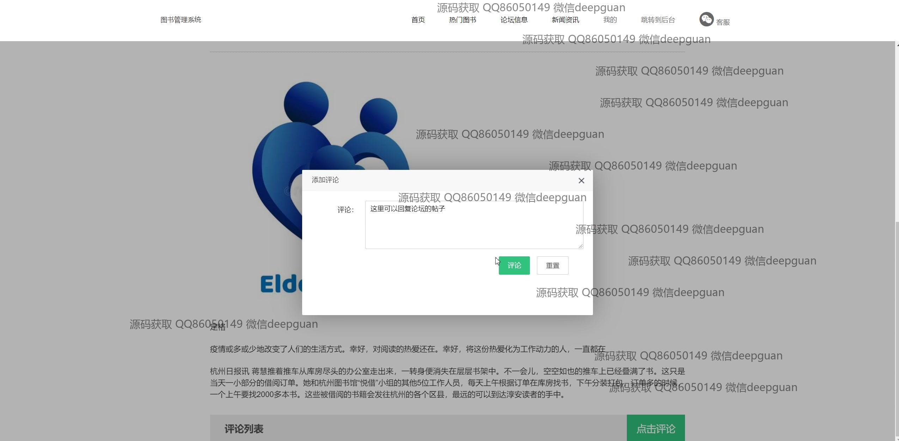
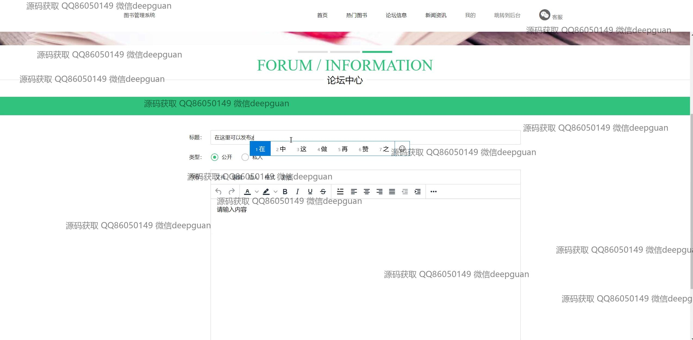
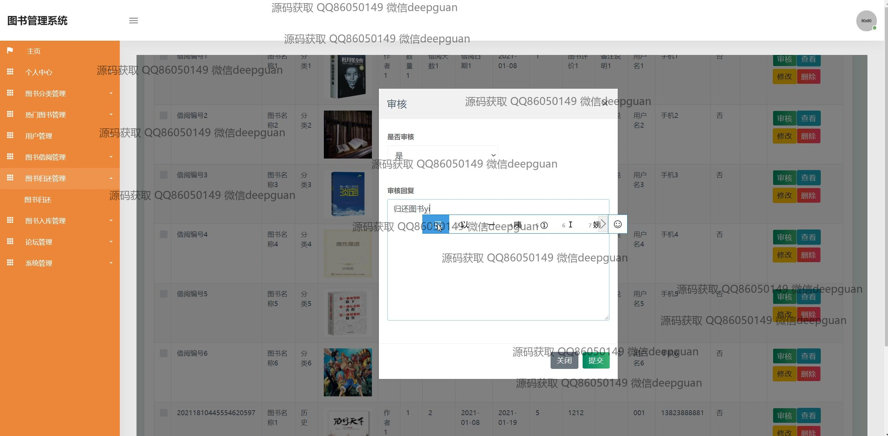

<h1 align="center">的图书借阅网站前端管理系统</h1>

## 简介
图书借阅网站前端管理系统：角色分为管理员、用户；提供图书管理、用户管理、借阅信息管理、评论互动、新闻资讯浏览等功能，支持用户注册登录、信息编辑、图书搜索与借阅等操作。    --计算机毕业设计源码；毕设源码；java毕业设计源码

## 联系方式

<h3 align="center">获取完整代码与数据库文件 + 微信：deepguan QQ: 86050149 QQ群: 783742310</h3>

<h3 align="center">可帮忙远程部署 包运行成功！提供远程部署、修改代码、设计文档指导、代码讲解等服务！</h3>

## 功能介绍（完整见运行截图）
管理员：授权管理功能，包括用户权限设置和论坛维护。提供详细的统计数据和图表，支持借阅记录分析和书籍管理，支持图书入库、修改、删除和入库记录管理。系统通知栏，包含系统公告和与用户的交互信息。可以通过搜索功能便捷地查看和更新系统资源。

用户：注册和登录功能，支持登录时身份选择与角色管理。个人中心提供信息查看和信息编辑选项，包括用户名、密码等个人信息的查看及修改，支持上传头像。提供图书浏览及借阅功能，包括图书搜索、分类浏览、热门图书、论坛信息及新闻资讯查看。论坛板块允许用户发表评论并参与互动，提供对自己发布内容的管理功能。

## 运行截图

本代码来源于网络,仅供学习参考使用!

